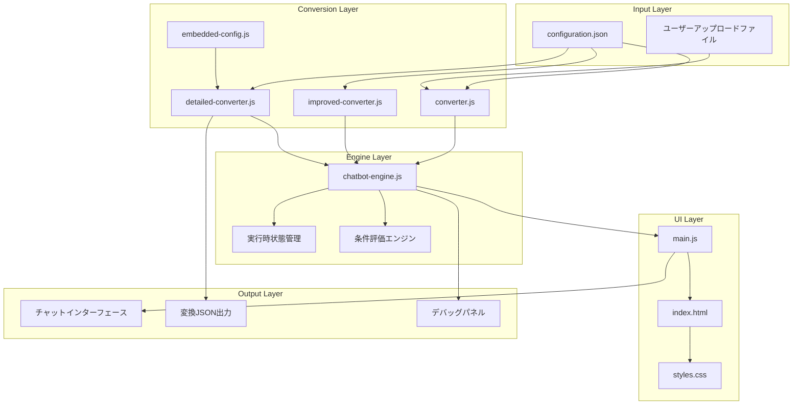
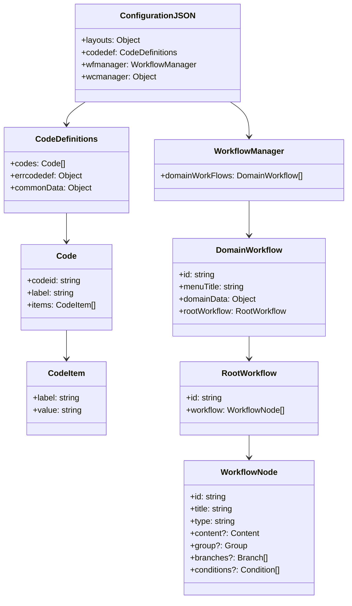
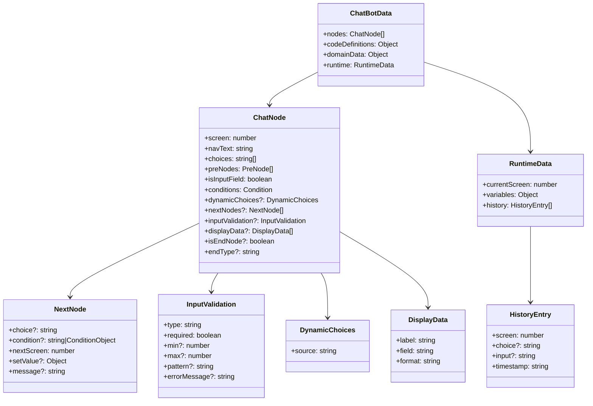
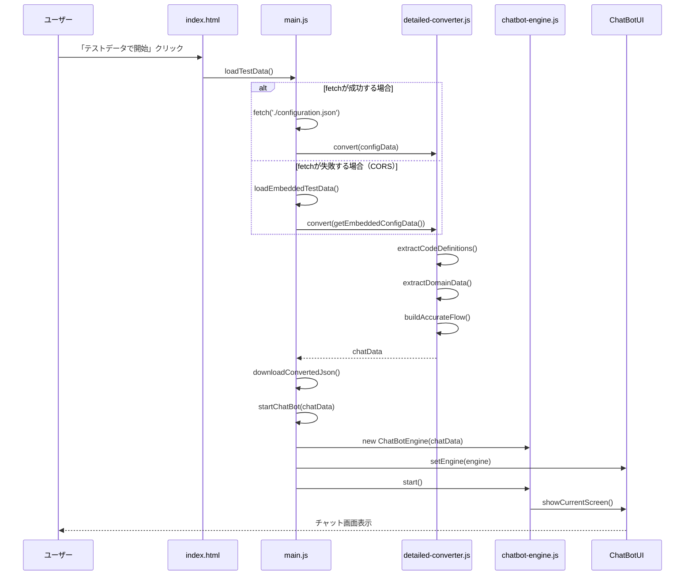
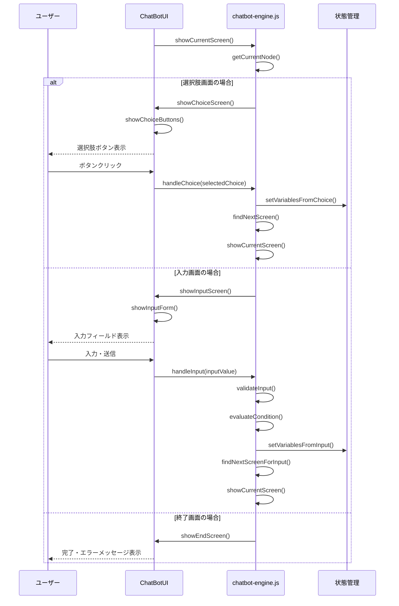
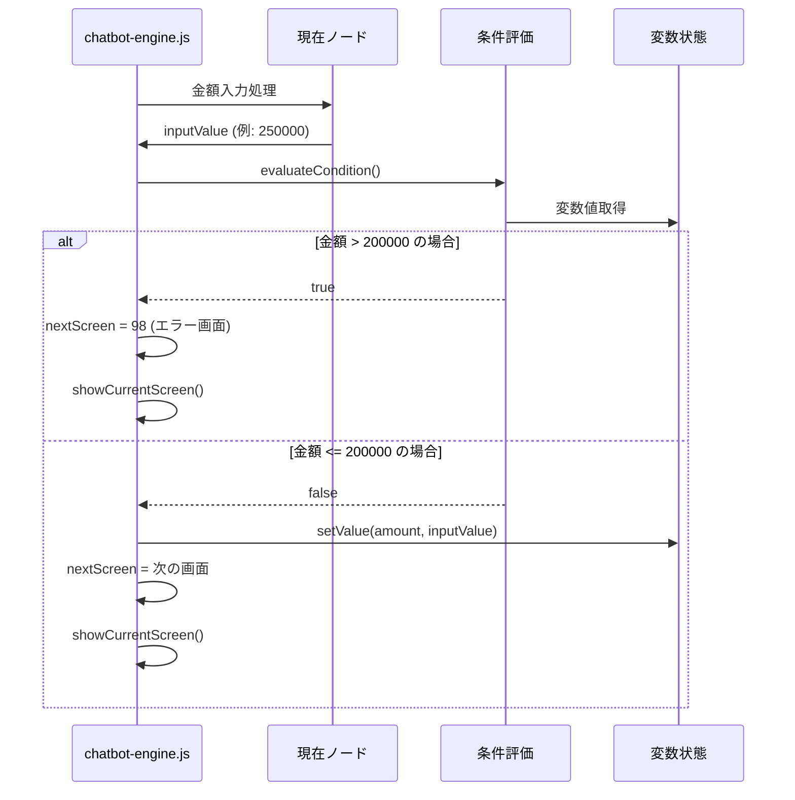
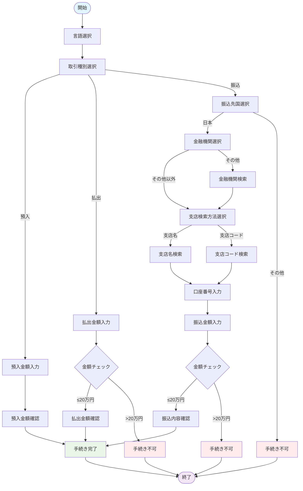
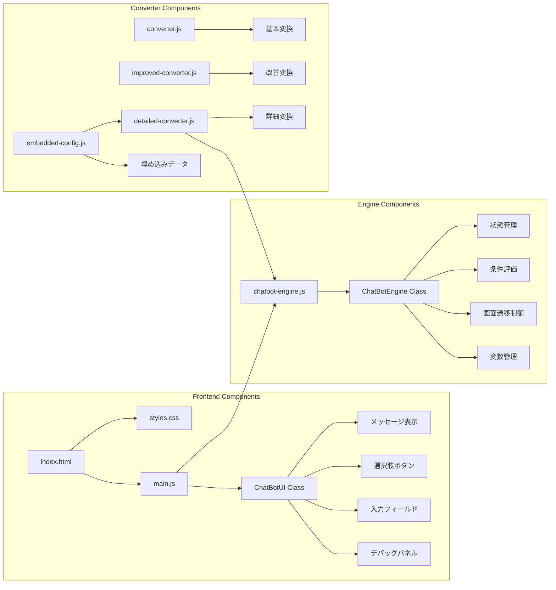
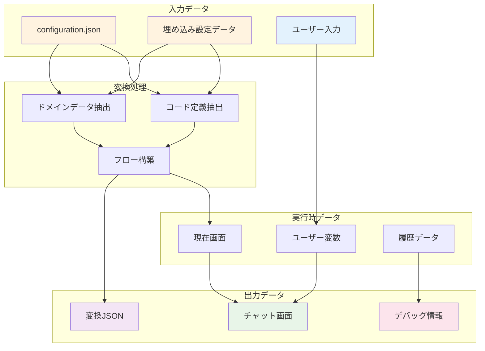

# チャットボットシステム - システム仕様書

## 概要

configuration.jsonから変換されたチャットボットシステムの包括的な設計・実装ドキュメント

---

## システム全体アーキテクチャ



---

## データスキーマ図

### 元のconfiguration.json構造



### 変換後チャットボット用JSON構造



---

## シーケンス図

### 1. システム初期化シーケンス



### 2. チャット対話シーケンス



### 3. 条件分岐処理シーケンス



---

## フロー図

### 業務フロー全体図



---

## コンポーネント構成図



---

## データフロー図



---

## 技術スタック

### フロントエンド
- **HTML5** - 基本構造
- **CSS3** - スタイリング（Flexbox、アニメーション）
- **Vanilla JavaScript** - ロジック実装
- **Fetch API** - データ取得

### データ処理
- **JSON** - データ形式
- **JavaScript Object** - 状態管理
- **RegExp** - 入力値検証

### 開発・デバッグ
- **Console API** - ログ出力
- **Blob API** - ファイルダウンロード
- **Python HTTP Server** - CORS回避

---

## パフォーマンス特性

### メモリ使用量
- **初期ロード**: ~500KB (全スクリプト)
- **実行時**: ~100KB (状態データ)
- **変換データ**: ~50KB (ノード定義)

### 処理速度
- **変換処理**: < 100ms
- **画面遷移**: < 50ms
- **条件評価**: < 10ms

### ブラウザ対応
- **Chrome**: 80+
- **Firefox**: 75+
- **Safari**: 14+
- **Edge**: 80+

---

## セキュリティ考慮事項

### データ保護
- クライアントサイド処理のみ
- 機密データの外部送信なし
- ローカルストレージ未使用

### 入力検証
- 数値範囲チェック
- 文字列パターン検証
- XSS対策（textContent使用）

### CORS対策
- 埋め込みデータフォールバック
- ローカルHTTPサーバー提供
- オリジン制限回避

---

## 拡張ポイント

### 機能拡張
1. **外部API連携** - 実際の銀行システム接続
2. **多言語対応** - i18n実装
3. **音声対応** - Speech API利用
4. **チャット履歴** - LocalStorage活用

### アーキテクチャ拡張
1. **モジュール分割** - ES6 Modules採用
2. **状態管理** - Redux/Vuex導入
3. **テスト** - Jest/Mocha追加
4. **ビルド** - Webpack/Vite導入

---

## 運用・保守

### ログ出力
```javascript
// デバッグレベル
console.log('情報ログ');
console.warn('警告ログ'); 
console.error('エラーログ');
```

### 状態監視
```javascript
// 実行時状態取得
engine.getState();

// 特定画面へジャンプ
engine.jumpToScreen(screenId);
```

### トラブルシューティング
1. **CORS エラー** → ローカルサーバー使用
2. **変換エラー** → コンソールログ確認
3. **画面遷移エラー** → デバッグパネル確認